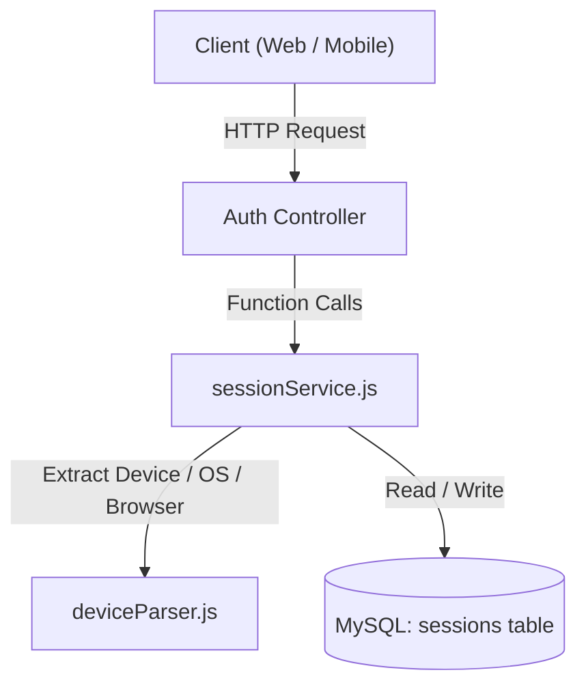

# Session Management Module

## 1. Overview
The Session Management Module manages user login sessions across desktop web browsers and mobile apps. It securely tracks logged-in devices, provides 30-day sliding refresh tokens, and allows users and SuperAdmins to revoke specific devices without disrupting active work on other devices.

---

## 2. Architecture at a Glance



---

## 3. Key Files

| File | Role |
| :--- | :--- |
| [`src/modules/auth/sessionService.js`](file:///c:/Mano/Code/GIT/MANO-HRM-Web/backend/src/modules/auth/sessionService.js) | **Main Engine**: Handles session creation, validation, extension, revocation, and metrics. |
| [`src/utils/deviceParser.js`](file:///c:/Mano/Code/GIT/MANO-HRM-Web/backend/src/utils/deviceParser.js) | **Device Detector**: Parses User-Agent & headers to detect OS, browser, device name, and device type. |
| [`src/modules/auth/authController.js`](file:///c:/Mano/Code/GIT/MANO-HRM-Web/backend/src/modules/auth/authController.js) | **API Controller**: Exposes login, refresh, logout, and device management endpoints. |
| MySQL `sessions` Table | **Database Storage**: Stores session tokens, device identity, IP history, and expiration state. |
| [`frontend/src/components/ActiveDevicesManager.jsx`](file:///c:/Mano/Code/GIT/MANO-HRM-Web/frontend/src/components/ActiveDevicesManager.jsx) | **User UI**: "Active Devices" modal on the user Profile page. |
| [`frontend/src/pages/super-admin/SessionManagement.jsx`](file:///c:/Mano/Code/GIT/MANO-HRM-Web/frontend/src/pages/super-admin/SessionManagement.jsx) | **Admin UI**: SuperAdmin dashboard for system-wide session telemetry and bulk revokes. |

### Database Schema (`sessions` Table)
* **Identifiers**: `id` (Session ID / `sid` embedded in JWT access tokens), `user_id` (foreign key to `core_users`).
* **Security**: `token_hash` (64-character SHA-256 hash; raw tokens are never stored).
* **Device Telemetry**: `device_id`, `device_name`, `device_type`, `os`, `browser`, `ip_address`, `user_agent`.
* **State & Validity**: `created_at`, `last_used_at`, `expires_at` (30-day sliding expiry), `revoked`, `revoked_at`, `revoked_reason`, `remember_me`.

---

## 4. API Endpoints

### User Endpoints (`/auth`)

| Method & Route | Access | What it does |
| :--- | :--- | :--- |
| `POST /auth/login` | Public | Authenticates user, creates a new row in `sessions`, and returns a JWT access token containing the session ID (`sid`). |
| `POST /auth/refresh` | Public / Token | Accepts refresh token via Cookie (web) or JSON body (mobile). Validates token, extends expiry by +30 days, and returns a new 15-minute access token. |
| `POST /auth/logout` | Authenticated | Revokes **only the requesting device**. Other active devices stay signed in. |
| `GET /auth/sessions` | Authenticated | Returns list of all active devices for the logged-in user, tagged with a `is_current` badge for the current device. |
| `POST /auth/sessions/:sessionId/revoke` | Authenticated | Remotely logs out a specific device from the user's Profile page. |
| `POST /auth/sessions/revoke-all-other` | Authenticated | Signs out of every device except the one making the request. |

### SuperAdmin Endpoints (`/superadmin/sessions`)

| Method & Route | Access | What it does |
| :--- | :--- | :--- |
| `GET /superadmin/sessions` | SuperAdmin | Returns paginated sessions with search (user, email, IP), status filters, and device breakdown. |
| `GET /superadmin/sessions/stats` | SuperAdmin | Returns KPI cards: total, active, revoked, expired, mobile vs desktop counts. |
| `POST /superadmin/sessions/:sessionId/revoke` | SuperAdmin | Forcibly terminates an individual user session. |
| `POST /superadmin/sessions/bulk-revoke` | SuperAdmin | Revokes multiple sessions at once by IDs. |
| `POST /superadmin/sessions/cleanup-expired` | SuperAdmin | Marks all expired sessions as revoked. |

---

## 5. How It Works (4 Core Rules)

1. **Isolated Logout (No Cascading)**:
   Logging out on your office computer ends *only that browser session*. Your mobile app remains signed in and operational.
2. **Password Reset Protection**:
   When a user changes their password, all *other* devices are immediately revoked to protect against stolen credentials, but the device that changed the password stays signed in.
3. **Sliding 30-Day Expiry**:
   Sessions stay alive for 30 days from their last active use. Every token refresh automatically extends the expiration date by another 30 days. If the user switches networks (Wi-Fi to mobile data), the session seamlessly updates the new IP without dropping.
4. **Token Security**:
   Refresh tokens are strong 80-character random hex strings. Raw tokens are **never stored** in the database; only their SHA-256 hash is saved.

---

## 6. Code Quick Reference

To interact with sessions inside the backend, import `sessionService`:

```javascript
import * as sessionService from './modules/auth/sessionService.js';

// 1. Create a session on login
const session = await sessionService.createSession(userId, rawToken, ipAddress, userAgent, deviceInfo);

// 2. Validate token on refresh
const authData = await sessionService.validateSession(rawToken);

// 3. Extend session by 30 days on activity
await sessionService.extendSession(rawToken, { ip: req.ip, userAgent: req.get('User-Agent') });

// 4. Revoke a single session
await sessionService.revokeSession(sessionId, 'user_logout');

// 5. Revoke all sessions EXCEPT the current one (e.g. password change)
await sessionService.revokeAllSessions(userId, { 
    exceptSessionId: currentSessionId, 
    reason: 'password_changed' 
});
```

---

## 7. Verification & Tests

To run the unit tests for session token hashing and exports:
```bash
node backend/test/sessionService.test.js
```
*(Runs 4 unit tests in ~15ms, zero external dependencies required).*
