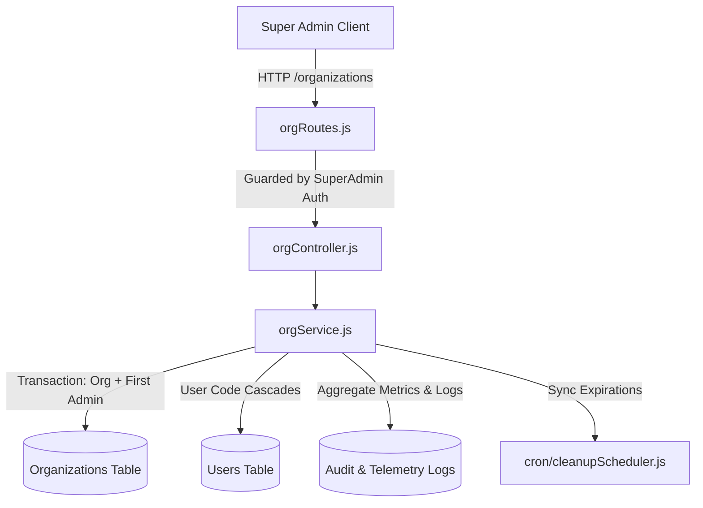

# Module: Organisations

> Place this file as README.md inside the module's own folder.
> This is a REFERENCE doc (Diataxis) — facts about the system, not a task log.
> Do not add author/date/status fields — git blame/log already gives you that.

## Purpose
The Organisations module provides multi-tenant administration for the Mano platform. It manages the lifecycle of each Organization (Tenant) — including onboarding, configuration updates, 75-day deferred deletion, and restoration — along with tenant code reservations, subscription plan metadata, initial administrator provisioning, tenant analytics aggregation, and normalized audit log queries.

## Responsibility (Bounded Context)
- **This module owns:**
  - Organization (Tenant) records: business profiles, tax identifiers (GST/PAN), and administrative contact details.
  - Organization code allocation and validation (3–10 uppercase letters).
  - Cascading user code prefix migrations across tenant members when an organization code changes.
  - Initial administrator provisioning and admin credential management (`user_type = 'admin'`).
  - Organization deletion scheduling (`status = 'pending_deletion'`) with a 75-day grace window, and deletion cancellation.
  - Tenant telemetry analytics (API call volume, error rates, active user counts, latency averages, module usage, platform breakdown).
  - Normalized audit log retrieval across activity, API, and error log collections.
- **This module does NOT own:**
  - Employee roster and staff management: It provisions the initial administrator account, but regular employee profiles and lifecycle belong to [employees](file:///backend/src/modules/employees/README.md).
  - Payment processing and invoicing: It stores subscription tier metadata, but checkout flows and transaction signatures belong to [payments](file:///backend/src/modules/payments/README.md).
  - Physical database purging: It sets the 75-day deferred deletion state; the actual cascading deletion of database records is executed by background cleanup jobs ([cleanupScheduler](file:///backend/src/cron/cleanupScheduler.js)).

## Dependencies
- **Depends on:**
  - Database Layer: `attendanceDB` via Knex.js ([backend/src/config/database.js](file:///backend/src/config/database.js)) querying the Organizations, Users, and Audit Log tables.
  - Authentication & Authorization: `authenticateJWT` and `authorize('super_admin')` ([backend/src/middleware/auth.js](file:///backend/src/middleware/auth.js)).
  - Cryptography: `bcrypt` for administrator password hashing on creation and credential update.
  - Scheduled Cleanup Utility: `deactivateExpiredOrganizations` ([backend/src/cron/cleanupScheduler.js](file:///backend/src/cron/cleanupScheduler.js)) to synchronize expired tenants prior to reads and updates.
  - Error Utilities: `AppError` ([backend/src/utils/AppError.js](file:///backend/src/utils/AppError.js)) and `catchAsync` ([backend/src/utils/catchAsync.js](file:///backend/src/utils/catchAsync.js)).
- **Depended on by:**
  - Super Admin Web Console: Consumes all `/organizations/*` endpoints for tenant management.
  - Global Auth Middleware: `requireActiveOrg` in [backend/src/middleware/auth.js](file:///backend/src/middleware/auth.js) checks tenant active status and subscription grace cutoffs before admitting any user request.
  - All Tenant Modules: Every operational entity throughout the platform (attendance punches, shifts, leave requests, etc.) maintains foreign keys referencing the Organization ID.

## Data Model
- **Organizations Entity** *(database table: `core_organizations`)*:
  - `org_id` (PK, auto-increment integer): Unique internal tenant identifier.
  - `org_name` (varchar): Registered commercial business name.
  - `org_code` (varchar, unique, 3–10 chars): Uppercase alphabetic prefix (e.g., `ACME`) prepended to all tenant user codes.
  - `status` (varchar): Current tenant status (`active`, `inactive`, `pending_approval`, `pending_deletion`).
  - `subscription_plan` (varchar): Primary plan enum (`free`, `pro`, `enterprise`).
  - `plan` (varchar): Legacy plan enum (`basic`, `pro`, `enterprise`, `free`).
  - `is_trial` (tinyint): `1` if operating under a trial period, `0` otherwise.
  - `subscription_expiry` (date/datetime): Expiration date of the active subscription.
  - `grace_period_days` (integer): Allowable days of continued access past expiration before automatic deactivation.
  - `max_users` (integer): Licensed user seat ceiling (default: 50).
  - `last_user_number` (integer): Sequential counter used to construct new user codes.
  - `gst_number`, `pan_number` (varchar): Indian tax registration identifiers.
  - `contact_name`, `contact_email`, `contact_phone` (varchar): Commercial point of contact.
  - `deletion_requested_at`, `deletion_scheduled_at`, `deletion_requested_by` (datetime): Lifecycle timestamps for the 75-day soft-deletion window.
- **Users Entity** *(database table: `core_users`)*:
  - `user_id` (PK): User identifier.
  - `org_id` (FK): Links user to their parent Organization (Tenant).
  - `user_code` (varchar, unique): Formatted as `{ORG_CODE}-{SEQUENTIAL_NUMBER}` (e.g., `ACME-001`).
  - `user_type` (varchar): Set to `admin` for tenant administrators provisioned through this module.

## Interface / API
All endpoints are mounted at `/organizations` and require `super_admin` authorization:

| Method | Endpoint | Description |
| :--- | :--- | :--- |
| `POST` | `/organizations` | Create an Organization (Tenant) and provision initial admin user within an atomic transaction. |
| `GET` | `/organizations` | List all organizations with aggregated active/inactive employee counts and mapped plan labels. |
| `GET` | `/organizations/check-code` | Verify if an organization code is valid and unallocated (`?code=XYZ&excludeId=1`). |
| `PUT` | `/organizations/:id` | Update organization profile, subscription, or code (cascades prefix update to all users). |
| `DELETE` | `/organizations/:id` | Schedule organization for deletion (initiates 75-day grace period). |
| `POST` | `/organizations/:id/cancel-deletion` | Cancel scheduled deletion and restore status to `active`. |
| `GET` | `/organizations/:id/admins` | List administrative users for the organization. |
| `PUT` | `/organizations/:id/admins/:adminId` | Update administrator profile, contact info, active status, or password. |
| `GET` | `/organizations/:id/analytics` | Compute request counts, error rates, average latency, module usage, and platform breakdown. |
| `GET` | `/organizations/:id/logs` | Fetch paginated, normalized logs (`type=activity\|api\|errors`, with search & platform filters). |

### Exported Functions (`orgService.js`)
- `createOrganization(payload)`: Inserts tenant record and initial `admin` user inside a database transaction.
- `getOrganizations()`: Synchronizes expired organizations and returns tenant list with user counts.
- `updateOrganization(id, payload)`: Updates organization columns; cascades user code re-prefixing if code changes.
- `deleteOrganization(id, user_id)`: Transitions status to `pending_deletion` and sets `deletion_scheduled_at` to `NOW() + 75 days`.
- `cancelOrgDeletion(id)`: Restores `pending_deletion` tenant to `active` and clears deletion timestamps.
- `getOrgAdmins(id)`: Returns user records where `org_id = id` and `user_type = 'admin'`.
- `updateOrgAdmin(id, adminId, payload)`: Mutates admin fields, hashing new password with bcrypt if provided.
- `getOrgAnalytics(id)`: Aggregates metrics from API logs, error logs, and user tables.
- `getOrgLogs(id, query)`: Normalizes and paginates system audit records across disparate log tables.
- `checkOrgCodeAvailability(code, excludeId)`: Validates format and checks uniqueness against existing organizations.

## Key Business Rules
- **Organization Code Format**: Must consist of 3 to 10 uppercase alphabetic characters (`/^[A-Z]+$/`). Numbers, spaces, hyphens, and special characters are rejected with HTTP 400.
- **Cascading User Code Re-prefixing**: When an organization's code is updated, an atomic transaction updates every member user. The prefix is replaced while preserving suffixes. If a collision occurs against another user in the database, an incrementing attempt counter (`-userId-attempt`) is attached to maintain global unique constraint integrity.
- **Dual Subscription Column Synchronization**: The system maintains both `subscription_plan` (mapped to `free`, `pro`, `enterprise`) and `plan` (mapped to `basic`, `pro`, `enterprise`, `free`) across insertions and updates to preserve compatibility with legacy endpoints.
- **75-Day Deletion Grace Period**: An organization deletion request does not purge data immediately. It assigns `status = 'pending_deletion'` and sets `deletion_scheduled_at = NOW() + 75 days` (`DELETION_GRACE_DAYS = 75`). The organization remains restorable by a super administrator throughout this period.
- **Dynamic Subscription Expiration Check**: Every call to `getOrganizations` or `updateOrganization` invokes `deactivateExpiredOrganizations()`, automatically transitioning tenants whose `subscription_expiry + grace_period_days` is in the past to `status = 'inactive'`.
- **Employee vs. Admin Seat Counting**: In `getOrganizations()`, aggregated user counts (`total_users`, `active_users`, `inactive_users`) filter exclusively for `user_type != 'admin' AND is_deleted = 0`, ensuring administrators do not consume licensed user seats.

## Edge Cases & Failure Modes
- **Duplicate Code or Email on Creation**: The uniqueness of organization code, admin email, and admin phone number are validated before the transaction begins. Collisions throw HTTP 400 with descriptive error messages.
- **Invalid Deletion Cancellation**: If `/organizations/:id/cancel-deletion` is invoked for an organization whose status is not `pending_deletion`, an HTTP 400 error is thrown.
- **Redundant Deletion Scheduling**: If `/organizations/:id` is deleted when already in `pending_deletion`, an HTTP 409 Conflict error is returned.
- **Non-Standard User Code Suffixes**: When updating an organization code, if a user code does not start with the old prefix (e.g. from manual legacy database imports), the migration script extracts trailing digits via regex or falls back to padding `user_id` to prevent null code violations.
- **Division by Zero in Analytics**: If an organization has zero API log entries, latency calculation safely defaults to `0 ms` and success rate defaults to `100%`.

## Known Limitations / Tech Debt
- **Synchronous User Code Migration**: Re-prefixing user codes during an organization code update runs synchronously inside an Express request transaction. For large organizations with thousands of employees, this can cause transaction lock contention or client timeouts. This should be refactored to an asynchronous BullMQ queue job.
- **Dual Plan Enums**: The presence of both `subscription_plan` and `plan` columns with differing enum sets creates redundant mapping logic in `orgService.js`.
- **Hardcoded Deletion Grace Constant**: `DELETION_GRACE_DAYS = 75` is hardcoded as a module constant. Per-tenant or policy-driven custom grace intervals are currently not supported — TBD — confirm with team if configurable deletion grace intervals are planned.

## Diagram (C4 Component level)

