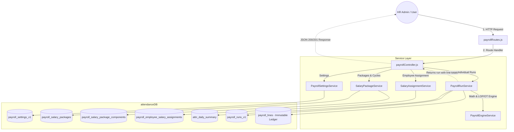
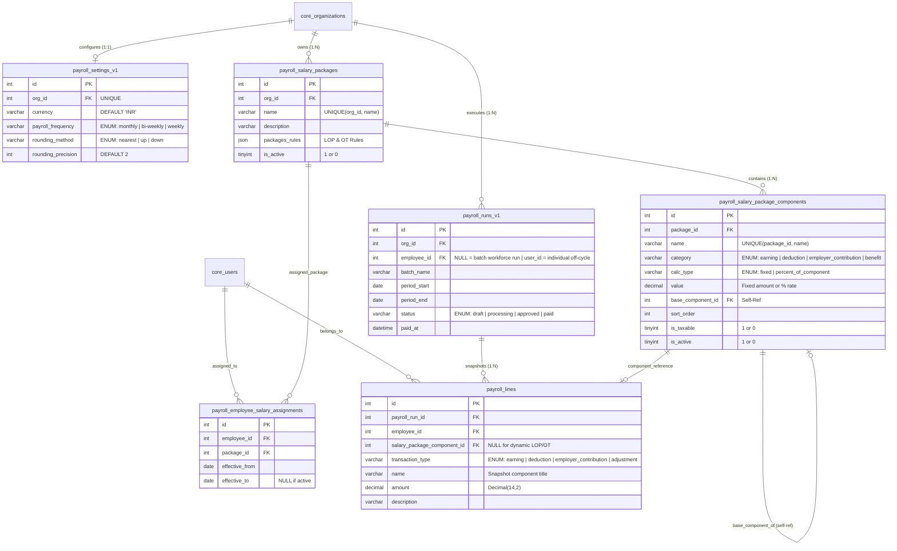

# Payroll Subsystem — Backend Guide & Architecture

> Single-source documentation for the entire payroll backend (`backend/src/modules/payroll`).  
> Plain-language guide covering system architecture, database schema, API route mappings, service function call chains, and calculation rules.

---

## 1. What This Module Does (In Plain English)

The **Payroll Module** automates an organization's monthly compensation workflow from start to finish:

1. **Defines Salary Packages**: HR creates salary packages (e.g., *Junior Developer*, *Operations Lead*) made up of multiple components like Basic Salary, HRA, Provident Fund, ESI, and Insurance.
2. **Assigns Packages to Staff**: Connects employees to a salary package starting on an effective date (`effective_from`). This powers the **Annexure A** compensation breakdown in offer letters and contracts.
3. **Pulls Attendance Data**: Reads biometric punch logs and daily attendance summaries to count how many days an employee was absent or on half-day, and how many overtime hours they worked.
4. **Calculates Net Pay**:
   - Deducts **Loss of Pay (LOP)** for unapproved absences.
   - Adds **Overtime Pay** if authorized by the employee's shift.
   - Subtracts statutory **Employee Deductions** (Employee PF, Professional Tax).
   - Separates **Company Contributions** (Employer PF, ESI, Gratuity) and **Benefits** so they are part of Cost to Company (CTC) without reducing the employee's take-home pay.
5. **Creates Frozen Payslips**: When payroll is run, every component and amount is saved into an immutable snapshot ledger (`payroll_lines`). Editing or deleting a salary package in the future **never** changes past payslips.

---

## 2. The 4 Money Categories

To keep calculations mathematically correct and compliant with Indian payroll laws, every salary component belongs to one of four strict categories:

| Category | Real-World Examples | Affects Employee Take-Home? | Included in CTC (Company Cost)? |
|---|---|---|---|
| **`earning`** | Basic Salary, HRA, Special Allowance, Overtime, Bonus | **YES (Increases Net Pay)** | **YES** |
| **`deduction`** | Employee PF (12%), Professional Tax (PT), TDS / Tax | **YES (Decreases Net Pay)** | No (comes out of earnings) |
| **`employer_contribution`** | Employer PF (12%), Employer ESI (3.25%), Gratuity | **NO** (Not cut from salary) | **YES** |
| **`benefit`** | Medical Insurance Premiums, Accidental Cover | **NO** (Non-cash perk) | **YES** |

### The Golden Formulas:
- $\text{Gross Salary} = \sum \text{Earnings} + \text{Overtime Pay}$
- $\text{Total Deductions} = \sum \text{Employee Deductions} + \text{Loss of Pay (LOP)}$
- $\mathbf{Net\ Take\text{-}Home\ Pay} = \max(0,\ \text{Gross Salary} - \text{Total Deductions})$
- $\mathbf{Total\ CTC\ (Cost\ to\ Company)} = \text{Gross Salary} + \sum \text{Employer Contributions} + \sum \text{Benefits}$

---

## 3. How the Data Flows (Visual Call Graph)



---

## 4. Database Schema, ER Diagram & ENUM Reference

### 4.1 Entity-Relationship (ER) Diagram



---

### 4.2 All ENUM & Allowed Values

| Table | Column | Allowed ENUM / CHECK Values | Default | Purpose / Meaning |
|---|---|---|---|---|
| `payroll_settings_v1` | `payroll_frequency` | `'monthly'`, `'bi-weekly'`, `'weekly'` | `'monthly'` | Organization payroll cadence. |
| `payroll_settings_v1` | `rounding_method` | `'nearest'`, `'up'`, `'down'` | `'nearest'` | Math rounding rule for line totals. |
| `payroll_salary_package_components` | `category` | `'earning'`, `'deduction'`, `'employer_contribution'`, `'benefit'` | — | Classifies money into earnings, employee cuts, employer retirals, or non-cash perks. |
| `payroll_salary_package_components` | `calc_type` | `'fixed'`, `'percent_of_component'` | `'fixed'` | Calculation formula type. |
| `payroll_runs_v1` | `employee_id` | `NULL` (Batch Workforce) or `user_id` (Individual Settlement) | `NULL` | Determines run scope without needing a redundant run_type enum column. |
| `payroll_runs_v1` | `status` | `'draft'`, `'processing'`, `'approved'`, `'paid'` | `'draft'` | Lifecycle state of a payroll run. |
| `payroll_lines` | `transaction_type` | `'earning'`, `'deduction'`, `'employer_contribution'`, `'adjustment'` | — | Direction of ledger row on employee payslip. |
| `packages_rules` (JSON) | `lop.basis` | `'gross'`, `'basic'` | `'gross'` | Daily rate basis for unpaid absence deduction. |
| `packages_rules` (JSON) | `lop.day_divisor` | `'calendar_days'`, `'fixed_26'`, `'fixed_30'`, `'working_days'` | `'calendar_days'` | Days divisor used to divide monthly salary into daily wage. |

---

### 4.3 Complete SQL Schema Code (MySQL 8.0+ / InnoDB)

```sql
-- 1. PAYROLL SETTINGS (V1)
CREATE TABLE IF NOT EXISTS payroll_settings_v1 (
    id INT UNSIGNED NOT NULL AUTO_INCREMENT,
    org_id INT UNSIGNED NOT NULL,
    currency VARCHAR(10) NOT NULL DEFAULT 'INR',
    payroll_frequency VARCHAR(20) NOT NULL DEFAULT 'monthly',
    rounding_method VARCHAR(20) NOT NULL DEFAULT 'nearest',
    rounding_precision INT NOT NULL DEFAULT 2,
    created_at DATETIME(6) NOT NULL DEFAULT CURRENT_TIMESTAMP(6),
    updated_at DATETIME(6) NOT NULL DEFAULT CURRENT_TIMESTAMP(6) ON UPDATE CURRENT_TIMESTAMP(6),
    PRIMARY KEY (id),
    UNIQUE KEY uq_payroll_settings_v1_org (org_id),
    CONSTRAINT fk_payroll_settings_v1_org FOREIGN KEY (org_id) REFERENCES core_organizations(org_id) ON DELETE CASCADE,
    CONSTRAINT chk_payroll_settings_v1_frequency CHECK (payroll_frequency IN ('monthly', 'bi-weekly', 'weekly')),
    CONSTRAINT chk_payroll_settings_v1_rounding CHECK (rounding_method IN ('nearest', 'up', 'down'))
) ENGINE=InnoDB;

-- 2. SALARY PACKAGES
CREATE TABLE IF NOT EXISTS payroll_salary_packages (
    id INT UNSIGNED NOT NULL AUTO_INCREMENT,
    org_id INT UNSIGNED NOT NULL,
    name VARCHAR(255) NOT NULL,
    description VARCHAR(255) NULL,
    packages_rules JSON NOT NULL,
    is_active TINYINT(1) NOT NULL DEFAULT 1,
    created_at DATETIME(6) NOT NULL DEFAULT CURRENT_TIMESTAMP(6),
    updated_at DATETIME(6) NOT NULL DEFAULT CURRENT_TIMESTAMP(6) ON UPDATE CURRENT_TIMESTAMP(6),
    PRIMARY KEY (id),
    UNIQUE KEY uq_payroll_salary_packages_org_name (org_id, name),
    UNIQUE KEY uq_payroll_salary_packages_id_org (id, org_id),
    CONSTRAINT fk_payroll_salary_packages_org FOREIGN KEY (org_id) REFERENCES core_organizations(org_id) ON DELETE RESTRICT
) ENGINE=InnoDB;

-- 3. SALARY PACKAGE COMPONENTS
CREATE TABLE IF NOT EXISTS payroll_salary_package_components (
    id INT UNSIGNED NOT NULL AUTO_INCREMENT,
    package_id INT UNSIGNED NOT NULL,
    name VARCHAR(100) NOT NULL,
    category VARCHAR(30) NOT NULL,
    calc_type VARCHAR(30) NOT NULL DEFAULT 'fixed',
    value DECIMAL(14,4) NOT NULL DEFAULT 0.0000,
    base_component_id INT UNSIGNED NULL,
    sort_order INT NOT NULL DEFAULT 0,
    is_taxable TINYINT(1) NOT NULL DEFAULT 1,
    is_active TINYINT(1) NOT NULL DEFAULT 1,
    created_at DATETIME(6) NOT NULL DEFAULT CURRENT_TIMESTAMP(6),
    PRIMARY KEY (id),
    UNIQUE KEY uq_payroll_salary_package_components_pkg_name (package_id, name),
    UNIQUE KEY uq_payroll_salary_package_components_pkg_id (package_id, id),
    CONSTRAINT fk_payroll_salary_package_components_package FOREIGN KEY (package_id) REFERENCES payroll_salary_packages(id) ON DELETE CASCADE,
    CONSTRAINT fk_payroll_salary_package_components_base FOREIGN KEY (package_id, base_component_id) REFERENCES payroll_salary_package_components(package_id, id) ON DELETE RESTRICT,
    CONSTRAINT chk_payroll_salary_package_component_category CHECK (category IN ('earning', 'deduction', 'employer_contribution', 'benefit')),
    CONSTRAINT chk_payroll_salary_package_component_calc_type CHECK (calc_type IN ('fixed', 'percent_of_component')),
    CONSTRAINT chk_payroll_salary_package_component_value CHECK (value >= 0),
    CONSTRAINT chk_payroll_salary_package_component_base CHECK ((calc_type = 'percent_of_component') = (base_component_id IS NOT NULL))
) ENGINE=InnoDB;

-- 4. EMPLOYEE SALARY ASSIGNMENTS
CREATE TABLE IF NOT EXISTS payroll_employee_salary_assignments (
    id INT UNSIGNED NOT NULL AUTO_INCREMENT,
    employee_id INT UNSIGNED NOT NULL,
    package_id INT UNSIGNED NOT NULL,
    effective_from DATE NOT NULL,
    effective_to DATE NULL,
    created_at DATETIME(6) NOT NULL DEFAULT CURRENT_TIMESTAMP(6),
    PRIMARY KEY (id),
    KEY idx_payroll_emp_salary_assignments_dates (employee_id, effective_from, effective_to),
    KEY idx_payroll_emp_salary_assignments_pkg (package_id),
    CONSTRAINT fk_payroll_emp_salary_assignments_emp FOREIGN KEY (employee_id) REFERENCES core_users(user_id),
    CONSTRAINT fk_payroll_emp_salary_assignments_pkg FOREIGN KEY (package_id) REFERENCES payroll_salary_packages(id),
    CONSTRAINT chk_payroll_emp_salary_assignment_dates CHECK (effective_to IS NULL OR effective_to >= effective_from)
) ENGINE=InnoDB;

-- 5. PAYROLL RUNS (V1)
CREATE TABLE IF NOT EXISTS payroll_runs_v1 (
    id INT UNSIGNED NOT NULL AUTO_INCREMENT,
    org_id INT UNSIGNED NOT NULL,
    employee_id INT UNSIGNED NULL, -- NULL = batch workforce run, user_id = individual settlement
    batch_name VARCHAR(150) NULL,
    period_start DATE NOT NULL,
    period_end DATE NOT NULL,
    status ENUM('draft', 'processing', 'approved', 'paid') NOT NULL DEFAULT 'draft',
    paid_at DATETIME NULL,
    created_at DATETIME NOT NULL DEFAULT CURRENT_TIMESTAMP,
    updated_at DATETIME NOT NULL DEFAULT CURRENT_TIMESTAMP ON UPDATE CURRENT_TIMESTAMP,
    PRIMARY KEY (id),
    CONSTRAINT fk_payroll_runs_v1_org FOREIGN KEY (org_id) REFERENCES core_organizations(org_id),
    CONSTRAINT fk_payroll_runs_v1_emp FOREIGN KEY (employee_id) REFERENCES core_users(user_id) ON DELETE SET NULL,
    CONSTRAINT chk_payroll_runs_v1_dates CHECK (period_end >= period_start)
) ENGINE=InnoDB;

-- 6. PAYROLL LINES (IMMUTABLE SNAPSHOT LEDGER)
CREATE TABLE IF NOT EXISTS payroll_lines (
    id INT UNSIGNED NOT NULL AUTO_INCREMENT,
    payroll_run_id INT UNSIGNED NOT NULL,
    employee_id INT UNSIGNED NOT NULL,
    salary_package_component_id INT UNSIGNED NULL,
    transaction_type VARCHAR(30) NOT NULL,
    name VARCHAR(150) NOT NULL,
    amount DECIMAL(14,2) NOT NULL,
    description VARCHAR(255) NULL,
    created_at DATETIME NOT NULL DEFAULT CURRENT_TIMESTAMP,
    PRIMARY KEY (id),
    CONSTRAINT fk_payroll_lines_run FOREIGN KEY (payroll_run_id) REFERENCES payroll_runs_v1(id) ON DELETE CASCADE,
    CONSTRAINT fk_payroll_lines_emp FOREIGN KEY (employee_id) REFERENCES core_users(user_id),
    CONSTRAINT fk_payroll_lines_comp FOREIGN KEY (salary_package_component_id) REFERENCES payroll_salary_package_components(id) ON DELETE SET NULL,
    CONSTRAINT chk_payroll_lines_type CHECK (transaction_type IN ('earning', 'deduction', 'employer_contribution', 'adjustment'))
) ENGINE=InnoDB;
```

---

## 5. API Routes: What Calls What, What It Returns & How It Is Used

All routes live under `/api/v1/payroll` and require JWT login (`authenticateJWT`). All administrative endpoints require `authorize('admin', 'hr')`.

### 5.1 Settings & Setup

#### `GET /api/v1/payroll/setup-status`
- **Controller**: `payrollController.getSetupStatus`
- **Service Called**: `PayrollSettingsService.getSettings(orgId)` + checks count of packages and assignments.
- **What It Returns**:
  ```json
  {
    "ok": true,
    "data": {
      "is_configured": true,
      "packages_count": 2,
      "assigned_employees_count": 14,
      "next_step": "ready_for_run"
    }
  }
  ```
- **How It Is Used**: The frontend uses this to show the onboarding progress bar (`configure_settings` &rarr; `create_package` &rarr; `assign_employees` &rarr; `ready_for_run`).

#### `GET /api/v1/payroll/settings`
- **Controller**: `payrollController.getPayrollSettings`
- **Service Called**: `PayrollSettingsService.getSettings(orgId)`
- **What It Returns**: Current settings or default template if not yet configured.
- **How It Is Used**: Populates the Settings modal on the dashboard.

#### `POST /api/v1/payroll/settings` (or `PUT`)
- **Controller**: `payrollController.updatePayrollSettings`
- **Service Called**: `PayrollSettingsService.saveSettings(orgId, req.body)`
- **Input Body**: `{ "currency": "INR", "payroll_frequency": "monthly", "rounding_method": "nearest", "rounding_precision": 2 }`
- **What It Returns**: Saved settings object.
- **How It Is Used**: Unlocks package creation and provides mathematical rounding parameters to the calculation engine.

---

### 5.2 Salary Packages & Components

#### `GET /api/v1/payroll/packages`
- **Controller**: `payrollController.listPackages`
- **Service Called**: `SalaryPackageService.listPackages(orgId)`
- **What It Returns**: Array of all packages with their components and the number of currently assigned employees (`assigned_employees_count`).
- **How It Is Used**: Renders the package cards in the UI and fills the dropdown in the Assign Package modal.

#### `POST /api/v1/payroll/packages`
- **Controller**: `payrollController.createPackage`
- **Services Called**:
  1. `PayrollSettingsService.isConfigured(orgId)` &rarr; Ensures settings exist.
  2. `SalaryPackageService.validateComponentGraph(components)` &rarr; Rejects any self-reference or circular loops.
  3. Inserts package and inserts components in topological order (fixed first, then percentages).
- **Input Body**: `{ "name": "Band A", "packages_rules": { ... }, "components": [ ... ] }`
- **What It Returns**: Newly created package with generated component IDs.
- **How It Is Used**: Saves new compensation structures and prevents cyclic graph bugs before touching the database.

#### `GET /api/v1/payroll/packages/:id`
- **Controller**: `payrollController.getPackageById`
- **Service Called**: `SalaryPackageService.getPackageById(orgId, id)`
- **What It Returns**: Complete package details with components list and assigned employee count.

#### `PUT /api/v1/payroll/packages/:id`
- **Controller**: `payrollController.updatePackage`
- **Service Called**: `SalaryPackageService.updatePackage(orgId, id, req.body)`
- **What It Returns**: Updated package record.

#### `DELETE /api/v1/payroll/packages/:id`
- **Controller**: `payrollController.deletePackage`
- **Service Called**: `SalaryPackageService.deletePackage(orgId, id)`
- **Guard**: Blocks deletion with a 400 error if any employees are currently assigned to this package.

#### `POST /api/v1/payroll/packages/:packageId/components`
- **Controller**: `payrollController.addPackageComponent`
- **Service Called**: `SalaryPackageService.addComponent(orgId, packageId, req.body)`
  - Calls `SalaryPackageService.validateNoCircularReference(...)` to ensure the base component exists in the package and is not cyclic.
- **What It Returns**: Created component record with its new database ID.

#### `PUT /api/v1/payroll/packages/:packageId/components/:componentId`
- **Controller**: `payrollController.updatePackageComponent`
- **Service Called**: `SalaryPackageService.updateComponent(orgId, packageId, componentId, req.body)`
  - Calls `SalaryPackageService.validateNoCircularReference(...)` to prevent self-referencing (`id === baseId`) or transitive cycles ($A \to B \to A$).
- **What It Returns**: Updated component record.

#### `DELETE /api/v1/payroll/packages/:packageId/components/:componentId`
- **Controller**: `payrollController.deletePackageComponent`
- **Service Called**: `SalaryPackageService.deleteComponent(orgId, packageId, componentId)`
- **Guard**: Blocks deletion if another component relies on this component as its base.

---

### 5.3 Employee Package Assignments

#### `GET /api/v1/payroll/assignments`
- **Controller**: `payrollController.listEmployeeAssignments`
- **Service Called**: `SalaryAssignmentService.listEmployeeAssignments(orgId, { department_id, search })`
- **What It Returns**: List of employees with their department, designation, and currently active salary package.
- **How It Is Used**: Renders the Employee Assignment table in the UI.

#### `GET /api/v1/payroll/employees/:employeeId/package`
- **Controller**: `payrollController.getEmployeePackage`
- **Service Called**: `SalaryAssignmentService.getEmployeeActivePackage(orgId, employeeId, asOfDate)`
  - Calls `SalaryPackageService.getPackageById(...)` internally to retrieve the full component list.
- **What It Returns**: Active package metadata and component list for that employee.
- **How It Is Used**: Opens `SalaryStructureModal.jsx` to show the 4-category cards and generate the printable **Annexure A** document.

#### `POST /api/v1/payroll/employees/:employeeId/assign-package`
- **Controller**: `payrollController.assignPackageToEmployee`
- **Service Called**: `SalaryAssignmentService.assignPackage(orgId, { employee_id, package_id, effective_from })`
- **Business Logic**: Automatically sets `effective_to` on the previous active package to `(effective_from - 1 day)` and inserts the new assignment.
- **What It Returns**: New assignment record.

#### `POST /api/v1/payroll/employees/:employeeId/unassign-package`
- **Controller**: `payrollController.unassignPackageFromEmployee`
- **Service Called**: `SalaryAssignmentService.unassignPackage(orgId, employeeId, effective_to)`
- **What It Returns**: Confirmation message.

---

### 5.4 Payroll Runs, Payslips & Projections

#### `POST /api/v1/payroll/runs`
- **Controller**: `payrollController.triggerPayrollRun`
- **Services Called**:
  - For company-wide runs: `PayrollRunService.createBatchRun(orgId, payload)`
  - For single employee runs: `PayrollRunService.createIndividualRun(orgId, payload)`
- **Execution Flow**:
  1. Queries all active employees.
  2. For each employee, calls `SalaryAssignmentService.getEmployeeActivePackage(...)`.
  3. Calls `PayrollRunService.getEmployeeAttendanceMetrics(...)` to count absences and overtime.
  4. Calls `PayrollEngineService.calculateEmployeePayroll(...)` to compute gross, LOP, and net pay.
  5. Bulk inserts frozen rows into `payroll_lines`.
  6. Creates header in `payroll_runs_v1` with status `'draft'`.
- **What It Returns**: Run details with total company payout summary and employee counts.
- **How It Is Used**: Triggered from the "Run Payroll" modal to generate a monthly payroll batch for review.

#### `GET /api/v1/payroll/runs`
- **Controller**: `payrollController.listPayrollRuns`
- **Service Called**: `PayrollRunService.listRuns(orgId, { run_type, status })`
- **What It Returns**: List of historical runs with total gross, total deductions, and net payout calculated from `payroll_lines`.

#### `GET /api/v1/payroll/runs/:runId`
- **Controller**: `payrollController.getPayrollRunDetails`
- **Service Called**: `PayrollRunService.getRunDetails(orgId, runId)`
- **What It Returns**: Full run details including individual employee breakdown cards and totals.

#### `PATCH /api/v1/payroll/runs/:runId`
- **Controller**: `payrollController.updatePayrollRunStatus`
- **Service Called**: `PayrollRunService.updateRunStatus(orgId, runId, { status })`
- **What It Returns**: Updated run with new status (`draft` &rarr; `approved` &rarr; `paid`). Stamps `paid_at` when paid.

#### `GET /api/v1/payroll/runs/:runId/employees/:employeeId/payslip`
- **Controller**: `payrollController.getEmployeePayslip`
- **Security Guard**: Employees can only access their own payslip (`req.user.user_id === employeeId`). Admins/HR can view any.
- **Service Called**: `PayrollRunService.getEmployeePayslip(orgId, runId, employeeId)`
- **What It Returns**: Complete immutable payslip with bank info, attendance stats, and grouped ledger lines.
- **How It Is Used**: Powers the printable Payslip view in the employee portal and admin dashboard.

#### `GET /api/v1/payroll/employees/:employeeId/projection`
- **Controller**: `payrollController.getEmployeeProjection`
- **Services Called**:
  1. `SalaryAssignmentService.getEmployeeActivePackage(...)`
  2. `PayrollRunService.getEmployeeAttendanceMetrics(...)`
  3. `PayrollEngineService.calculateEmployeePayroll(...)`
- **What It Returns**: Live simulated salary calculation using the employee's current attendance records **without saving any rows to the database**.
- **How It Is Used**: Shows HR an instant preview of what an employee will be paid before officially committing the run.

---

## 6. Who Calls What: Service Dependency Matrix

| Caller Function | Service / Function It Calls | What It Passes | What It Receives Back | Why It Needs It |
|---|---|---|---|---|
| `createPackage` | `PayrollSettingsService.isConfigured` | `orgId` | `true / false` | Prevents creating packages before currency and rounding are set. |
| `createPackage` | `SalaryPackageService.validateComponentGraph` | `components` array | `void` (or throws) | Validates no circular percentage dependencies exist in the new package. |
| `addComponent` & `updateComponent` | `SalaryPackageService.validateNoCircularReference` | `packageId, componentId, baseId` | `void` (or throws) | Traces component ancestor tree to ensure a component never depends on itself directly or indirectly. |
| `getEmployeeActivePackage` | `SalaryPackageService.getPackageById` | `orgId, package_id` | Package with components | Combines employee assignment dates with the full salary structure. |
| `createBatchRun` | `SalaryAssignmentService.getEmployeeActivePackage` | `orgId, employee_id, period_end` | Active package details | Finds out which salary structure applies to this employee for this month. |
| `createBatchRun` | `PayrollRunService.getEmployeeAttendanceMetrics` | `employeeId, start, end` | `{ absents, half_days, OT }` | Pulls real biometric attendance records for LOP and overtime calculations. |
| `createBatchRun` | `PayrollEngineService.calculateEmployeePayroll` | Employee + Package + Attendance | `{ gross, deductions, net, lines }` | Executes math formulas, calculates LOP and OT, and creates frozen ledger rows. |
| `getEmployeeProjection` | `PayrollEngineService.calculateEmployeePayroll` | Employee + Package + Attendance | Calculation breakdown | Provides live preview without modifying the database. |

---

## 7. Business & Calculation Rules (Simplified)

### 1. Loss of Pay (LOP)
When an employee has unapproved absences or half-days:
- **Daily Rate** = $\frac{\text{Basis Amount (Gross or Basic)}}{\text{Divisor (Calendar Days, 26, 30, or Working Days)}}$
- **LOP Deduction** = $\text{Daily Rate} \times (\text{absent\_days} + 0.5 \times \text{half\_days})$
- Recorded as a line item on the payslip under Deductions.

### 2. Overtime (OT)
- **Shift Permission Check**: Overtime pay is **only** awarded if the employee's assigned shift has `is_overtime_enabled = true`.
- **OT Pay** = $\text{Overtime Hours} \times \text{Hourly Rate} \times \text{Multiplier (e.g. 1.5x)}$.

### 3. Cycle & Self-Reference Defense
- **Direct Self-Reference**: Setting `base_component_id` equal to the component's own ID is immediately blocked with `400 Bad Request`.
- **Chained Cycles**: Setting Component A to depend on Component B when B already depends on A ($A \to B \to A$) is detected by graph traversal and rejected with a clear path message.
- **Engine Fallback**: In `PayrollEngineService`, percentage components resolve in topological order. If legacy data ever contains a corrupt reference, the engine defaults that component safely to ₹0 instead of crashing or looping indefinitely.

### 4. Immutable Payslips
- All payroll numbers are saved into `payroll_lines` with their frozen component names and amounts when a run is generated.
- Even if HR modifies or deletes a salary package later, historical payslips remain 100% identical and tamper-free.
