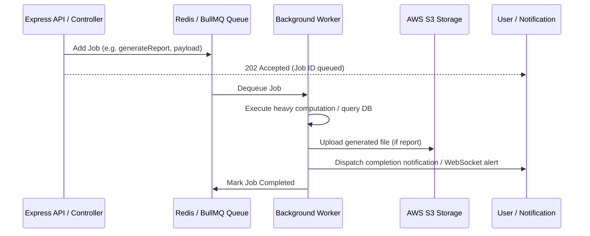

# Background Workers (`src/workers/`)

## Overview
The `src/workers/` directory implements background consumer worker processes powered by **BullMQ** and **Redis**. Workers offload compute-intensive and I/O-heavy tasks (such as bulk attendance processing, GPS geofence calculations, and large export document rendering) from the main HTTP event loop to ensure high API responsiveness.

---

## File Manifest

| Worker File | Associated Queue | Primary Processing Tasks |
| :--- | :--- | :--- |
| **`attendanceWorker.js`** | `attendanceQueue` | Processes asynchronous bulk attendance transactions, batch geofence validations, shift roster matching, and real-time attendance metric updates. |
| **`reportWorker.js`** | `reportQueue` | Generates large multi-sheet Excel spreadsheets, CSV data exports, and PDF reports in the background, uploading generated assets to AWS S3 and triggering user notifications upon completion. |

---

## Worker Architecture & Job Flow



---

## Configuration & Reliability
* **Concurrency**: Workers run with configurable concurrency limits to avoid exhausting database connection pools.
* **Automatic Retries**: Jobs configure exponential backoff retry strategies (e.g. 3 attempts with 5-second delays) for transient network or database failures.
* **Dead Letter Handling**: Permanently failed jobs are logged with complete stack traces for monitoring and investigation.

---

## Running Workers

In a production environment, workers are managed via PM2 as dedicated worker processes or executed concurrently within the application:

```bash
# Direct startup
node src/workers/attendanceWorker.js
node src/workers/reportWorker.js
```
