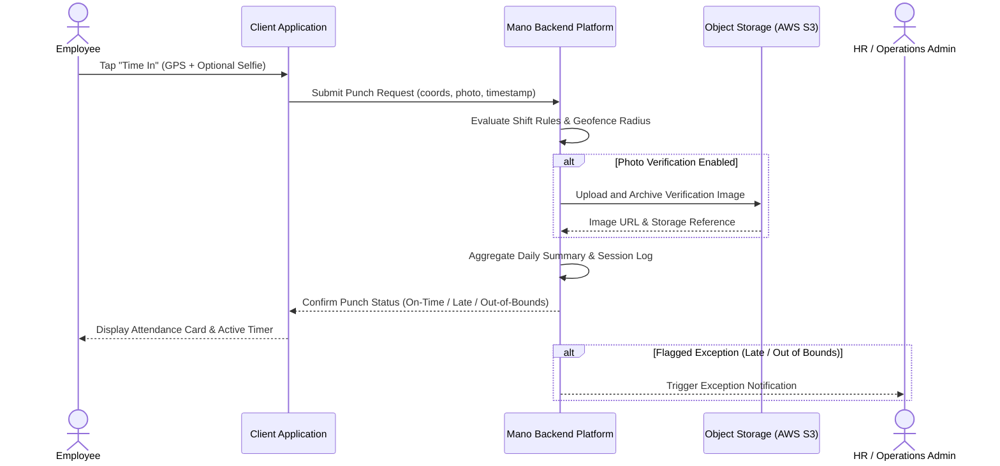

# Feature: Attendance Verification and Shift Tracking

> Place this file in /docs/features/. This describes the SYSTEM, not the work.
> This is an EXPLANATION doc (Diataxis) — business POV, plain language.
> Do not add author/assignee/status fields — task assignment lives in GitHub Issues.

## Business Goal
Give organizations verified, tamper-resistant proof of employee presence while providing workers with a transparent, friction-free way to log work hours across assigned branches, remote worksites, and varying shift patterns.

## User Journey
Step-by-step what the user experiences, start to finish:
1. The employee arrives at work and initiates a check-in ("Time In") from their desktop browser or mobile application.
2. The client application captures current GPS coordinates and, if required by company policy, prompts for a live verification photo.
3. The backend evaluates the employee's proximity against approved workplace geofences and compares the punch timestamp against the scheduled shift timetable.
4. The employee receives instant feedback indicating their punch was recorded, along with relevant flags (e.g., on-time arrival, late arrival, or out-of-boundary warning).
5. Throughout the day, the employee can record mid-shift break departures and returns; each pair of punches is grouped into a distinct work session.
6. At shift completion, the employee logs "Time Out". The backend calculates total payable hours, late arrival minutes, and early departure intervals for administrative and payroll processing.

## Business Rules
Rules a non-technical stakeholder (PM, client, support) needs to know:
- **Geofence Enforcement**: Punches must originate within the authorized meter radius of an assigned office or job site. Punches outside the perimeter are flagged for administrative audit rather than silently dropped.
- **Grace Period Allowance**: A configurable window (e.g., 10–15 minutes post shift-start) allows employees to clock in without incurring late penalties.
- **Shift Policy Fallback**: If an employee has not been assigned a specific personal shift schedule, they automatically inherit the organization's active default shift policy.
- **Conditional Selfie Verification**: Shifts can toggle photo verification on or off. When active, punches without an accompanying live photo capture are rejected.
- **Break Continuation Window**: Breaks shorter than the configured threshold (120 minutes) continue the existing workday instance rather than creating a disconnected calendar record.
- **Overnight Shift Attribution**: Shifts spanning midnight associate morning check-outs with the preceding calendar day's shift instance to preserve single-day payroll calculations.
- **Absence vs. Approved Leave**: If no punches are registered for a scheduled shift day, the system checks for approved leave requests before marking the employee as absent.
- **Correction Window Limit**: Correction requests for missed or faulty punches must be submitted within the shift correction deadline (default fallback is 30 days) — TBD — confirm with team whether per-organization custom overrides are enabled in production.

## Systems Involved
Which modules/services participate, and in what order. Technical implementation details live in each module's own documentation:

Authentication Middleware → [Shift & Policy Module](file:///backend/src/modules/shifts/README.md) → [Location & Geofencing Module](file:///backend/src/modules/locations/README.md) → [Attendance Engine](file:///backend/src/modules/attendance/README.md) → [Cloud Storage Service (S3)](file:///backend/src/services/s3/README.md) → [Daily Activity Reconciliation (DAR)](file:///backend/src/modules/DAR/README.md) → [Notification Service](file:///backend/src/modules/notifications/README.md)

## Edge Cases (Business View)
Exceptional situations described in business terms, not stack traces:
- **Punch Outside Authorized Geofence**: Punch is accepted and saved, but tagged with an out-of-boundary compliance flag; manager is alerted for manual verification.
- **Overnight Shift Checkout (Next Calendar Day)**: System recognizes the active shift window and pairs the morning checkout with yesterday's check-in without fragmenting payroll totals.
- **Unclosed Workday (Missed Checkout)**: Work session remains open; system highlights the missed punch on administrative dashboards and prompts the worker to file a correction request (TBD — confirm with team whether an automated auto-checkout timeout applies after 18 hours).
- **Punch on a Holiday or Approved Leave**: System records the activity and flags the day for compensatory off or overtime approval rather than overwriting the leave entry.

## Flow Diagram (C4 "Context" level)

## Glossary
Terms specific to this feature that need shared meaning across the team (see also /docs/glossary.md for system-wide terms):
- **Punch**: A single recorded attendance event (arrival or departure) capturing time, coordinates, device identity, and verification data.
- **Session**: A paired interval between an arrival punch ("Time In") and departure punch ("Time Out").
- **Geofence**: A circular geographic boundary defined by center coordinates (latitude/longitude) and radius in meters around an approved work location.
- **Grace Period**: The allowable window after a shift's official start time during which arrival is not penalized as late.
