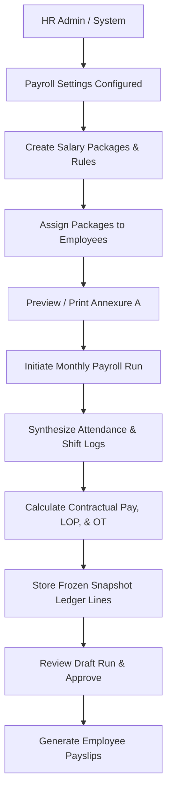

# Feature: Payroll Management & Salary Compensation Engine

> Place this file in /docs/features/. This describes the SYSTEM, not the work.
> This is an EXPLANATION doc (Diataxis) — business POV, plain language.
> For full statutory compliance, gratuity, PF, ESI, and tax theory, see [Payroll Theory & Compliance Guide](./payroll-theory-and-compliance.md).
> For technical implementation details, see [Payroll Module README](../../backend/src/modules/payroll/README.md) and [ADR-0003](../adr/0003-payroll-compensation-and-salary-calculation-engine.md).

---

## Business Goal
Provide organizations with an automated, transparent, and legally compliant payroll engine that calculates monthly compensation from verified attendance records (Loss of Pay, overtime, and work shifts), separates statutory company retirals from employee deductions, and produces verifiable payslips and printable Annexure A employment salary breakdowns.

---

## User Journey

### 1. Setup & Configuration (First-Time Onboarding)
1. The HR administrator accesses the Payroll dashboard and views the Setup Progress checklist.
2. The administrator sets the organization's currency (`INR`), pay frequency (`monthly`), and rounding precision (`nearest 2 decimal places`).

### 2. Defining Salary Packages
1. The administrator creates standardized salary packages (e.g., "Full-Time Operations Grade A", "Junior Developer").
2. The package defines contractual components categorized into:
   - **Earnings**: Basic Salary, House Rent Allowance (HRA), Special Allowance, Bonus, Shift Allowance.
   - **Employee Deductions**: Employee Provident Fund (12% of Basic), Professional Tax (₹200).
   - **Company Contributions**: Employer Provident Fund (12% of Basic), Employer ESI (3.25%), Gratuity.
   - **Benefits**: Non-cash medical and accident insurance premiums.
3. The administrator sets policies in the package rules: LOP day divisor (`calendar_days`, `fixed_26`, `fixed_30`, or `working_days`) and overtime multipliers.

### 3. Assigning Packages to Employees
1. The administrator navigates to the Salary Assignments tab and assigns a package to employees effective from a specific start date (`effective_from`).
2. The employee's previous package assignment is automatically versioned and ended (`effective_to`).
3. The administrator clicks "View Structure" to preview the 4-tier interactive salary card or generate a formal printout of the **Annexure A** compensation schedule for employment agreements.

### 4. Running Monthly Payroll
1. At month-end, the administrator initiates a **Batch Payroll Run** for the pay period (e.g., Oct 1 to Oct 31).
2. The system queries attendance logs to automatically compute unapproved absent days, half-days, and authorized overtime hours.
3. The engine computes exact contractual components, applies LOP deductions, computes overtime pay, and generates draft ledger line items (`payroll_lines`).
4. The administrator reviews the draft run totals (`gross_payout`, `total_deductions`, `net_payout`, `employer_contributions`).
5. After review, the administrator transitions the run status from `draft` &rarr; `approved` &rarr; `paid`.

### 5. Employee Self-Service & Payslips
1. Employees view their assigned salary breakdown under their personal profile.
2. When payroll is marked `paid`, employees can view and print their individual payslip showing attendance days, earnings, statutory deductions, and net deposited pay.

---

## Business Rules
- **4-Tier Financial Categorization**:
  - `earning`: Adds directly to Gross Pay and Net Take-Home Pay.
  - `deduction`: Withheld from the employee's payout (e.g. Employee PF, Professional Tax, TDS).
  - `employer_contribution`: Paid by the company on the employee's behalf (e.g. Employer PF match, Employer ESI, Gratuity); part of CTC, but **never** deducted from the employee's pay.
  - `benefit`: Non-cash perks (e.g. Group Health Insurance); counted toward total CTC, not included in liquid cash payout.
- **Strict Loss of Pay (LOP) Enforcement**: Unapproved absences automatically deduct $\frac{\text{Basis Amount}}{\text{Day Divisor}} \times \text{Absent Days}$. Half-days deduct 0.5 units.
- **Overtime Pay Pre-Authorization**: Employees only earn overtime pay if their assigned shift has `is_overtime_enabled = true`.
- **Immutable Historical Records**: Editing or deleting a salary package today never alters historical payslips from previous months.
- **Cycle-Free Component Hierarchy**: A salary component cannot reference itself directly or indirectly as its calculation base.
- **Net Pay Floor**: Net take-home pay cannot be negative. If deductions exceed gross earnings, Net Pay is floored at ₹0.00.

---

## Systems Involved
Authentication Middleware (`authenticateJWT`, `authorize('admin', 'hr')`) &rarr; [Payroll Module](file:///backend/src/modules/payroll/README.md) &rarr; [Attendance Engine](file:///backend/src/modules/attendance/README.md) &rarr; [Shifts Module](file:///backend/src/modules/shifts/README.md) &rarr; MySQL InnoDB Database

---

## Edge Cases (Business View)
- **Unassigned Employee During Batch Run**: An employee without an active salary package is flagged in the audit summary and skipped rather than generating a corrupt ₹0 ledger.
- **Mid-Month Salary Revision**: When an increment takes effect mid-month, the system honors the date ranges of each assignment.
- **Off-Cycle Final Settlement**: HR can trigger an `individual` run type for an employee resigning mid-period without running payroll for the entire company.
- **Shift Overtime Disabled**: If an employee logs overtime hours on a shift where overtime is not authorized by company policy, overtime pay is calculated as ₹0.00.

---

## Flow Diagram

---

## Glossary
- **CTC (Cost to Company)**: The total financial cost incurred by the employer for an employee, consisting of Gross Earnings + Company Retirals + Non-cash Benefits.
- **Gross Earnings**: Contractual earnings plus overtime and incentives before any employee deductions or tax withholdings.
- **Net Take-Home Pay**: The actual liquid salary transferred to the employee's bank account (`Gross Earnings - Total Deductions`).
- **Annexure A**: The official compensation breakdown schedule attached to employment contracts and promotion letters.
- **Loss of Pay (LOP)**: Statutory deduction for unpaid absences or unauthorized leave.
- **Employer Retirals**: Statutory benefits paid by the company, including Employer PF (12%), ESI (3.25%), and statutory gratuity provision.
