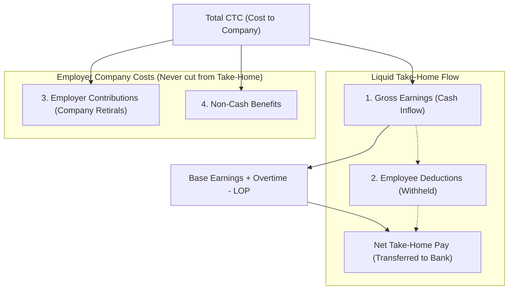
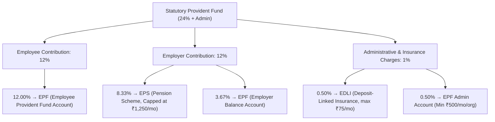
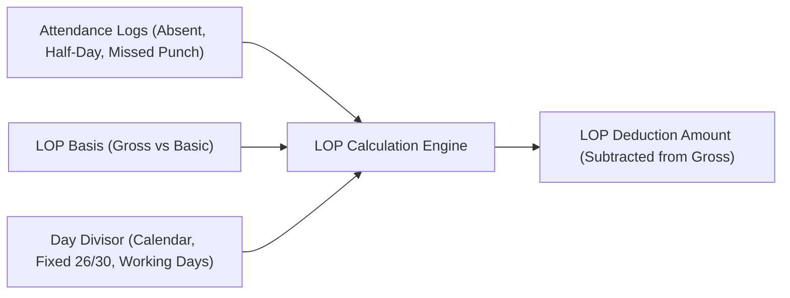

# Payroll Theory, Statutory Compliance & Salary Architecture Guide

> **Scope**: Complete theoretical and legal foundation for the MANO HRM Workforce Intelligence Platform payroll engine.  
> **Audience**: HR Leaders, Payroll Administrators, System Architects, Legal & Compliance Officers, and Engineering Teams.  
> **Related Documents**: [Payroll Management Feature Guide](./payroll-management.md), [Payroll Module Technical README](../../backend/src/modules/payroll/README.md), [ADR-0003 Compensation Engine Architecture](../adr/0003-payroll-compensation-and-salary-calculation-engine.md).

---

## 1. Executive Summary & The 4-Tier Financial Framework

Payroll calculation is not merely an arithmetic aggregation of hours worked; it is a legally binding contract subject to state and federal labour laws, statutory retirals, and taxation codes.

To guarantee auditability, zero fiscal liability, and transparency, every rupee in a salary compensation structure is classified into one of **four immutable categories**:



### The 4 Money Categories

| Category | Real-World Examples | Affects Employee Take-Home? | Counted in CTC? | Legal Obligation |
| :--- | :--- | :--- | :--- | :--- |
| **`earning`** | Basic Salary, HRA, Special Allowance, Conveyance, Overtime Pay, Performance Bonus | **YES (Increases Pay)** | **YES** | Contractual liability payable as liquid compensation. |
| **`deduction`** | Employee PF (12%), Employee ESI (0.75%), Professional Tax (PT), TDS (Income Tax) | **YES (Decreases Pay)** | **NO** *(Already part of Gross)* | Statutory withholding; employer acts as fiduciary remitter. |
| **`employer_contribution`** | Employer PF Match (12%), Employer ESI (3.25%), Gratuity Provision (4.81%) | **NO** *(Never cut from pay)* | **YES** | Mandatory social security contribution funded by employer. |
| **`benefit`** | Group Term Life Insurance, Family Health Floater, Accidental Insurance Premiums | **NO** *(Non-cash perk)* | **YES** | Non-cash employment benefits negotiated in compensation. |

### The Core Payroll Formulas

$$\begin{aligned}
\mathbf{Gross\ Salary} &= \sum \text{Earnings} + \text{Overtime Pay} - \text{Loss of Pay (LOP)} \\
\mathbf{Total\ Deductions} &= \sum \text{Employee Deductions} + \text{TDS (Withholding Tax)} \\
\mathbf{Net\ Take\text{-}Home\ Pay} &= \max\left(0,\ \mathbf{Gross\ Salary} - \mathbf{Total\ Deductions}\right) \\
\mathbf{Total\ CTC} &= \mathbf{Gross\ Salary} + \sum \text{Employer Contributions} + \sum \text{Benefits}
\end{aligned}$$

---

## 2. Gratuity (The Payment of Gratuity Act, 1972)

### 2.1 What is Gratuity?
Gratuity is a statutory retiral and terminal benefit mandated by **The Payment of Gratuity Act, 1972**. It is paid by the employer to an employee in recognition of long-term, meritorious, continuous service upon separation (retirement, superannuation, resignation, death, or permanent disablement).

### 2.2 Applicability & Eligibility
- **Establishment Coverage**: Applies to factories, mines, oilfields, ports, railways, shops, and commercial establishments employing **10 or more persons** on any day of the preceding 12 months.
- **Continuous Service Requirement**: An employee becomes eligible for gratuity upon completing **at least 5 continuous years of service** with the same organization.
- **Exceptions to 5-Year Threshold**: The 5-year condition is **waived** if termination of employment is due to:
  1. Death of the employee (gratuity is paid to the legal nominee/heir).
  2. Disablement due to accident or disease.

### 2.3 The Statutory Settlement Formula
When an employee exits after qualifying for gratuity, the lump-sum payable is calculated as:

$$\mathbf{Gratuity\ Payout} = \frac{15 \times \text{Last Drawn (Basic} + \text{DA)} \times \text{Completed Years of Service}}{26}$$

#### Deep-Dive into the Formula Variables:
1. **15 Days Wages**: Under Indian labour law, a half-month's wages is quantified as 15 working days.
2. **26 Days Divisor**: The Supreme Court of India (*Jeewanlal Ltd. v. Appellate Authority*) established that a standard working month contains **26 working days**, assuming 4 weekly rest days (Sundays). Thus, dividing monthly wages by 26 yields the legal daily wage rate.
3. **Completed Years of Service (Rounding Rule)**:
   - Continuous service greater than **6 months** in the final year is rounded up to a full year.
   - Example 1: 5 years and 7 months &rarr; Counted as **6 years**.
   - Example 2: 5 years and 5 months &rarr; Counted as **5 years**.
4. **Statutory Ceiling Cap**: The Central Government caps maximum tax-free statutory gratuity at **₹20,00,000 (₹20 Lakhs)** under Section 4(3) (enhanced from ₹10 Lakhs in 2018). Any gratuity paid beyond ₹20 Lakhs is taxable as income in the hands of the recipient.

### 2.4 Monthly Accrual & CTC Provisioning (4.81% Rule)
Companies account for the gratuity liability dynamically in their financial books and employee CTC breakdowns rather than incurring a sudden unbudgeted cash expense when long-tenured employees resign.

$$\mathbf{Monthly\ Accrual\ Factor} = \frac{15 \text{ days}}{26 \text{ days/month} \times 12 \text{ months}} = \frac{15}{312} \approx \mathbf{4.8077\%} \approx \mathbf{4.81\%}$$

$$\mathbf{Monthly\ Gratuity\ CTC\ Provision} = 4.81\% \times \text{Basic Salary}$$

> [!IMPORTANT]
> **Audit & Compliance Rule**:
> The monthly gratuity figure in a CTC schedule is an **employer provision/accrual**. It is:
> 1. **NEVER** deducted from the employee's monthly salary.
> 2. **NEVER** paid out as liquid cash in the monthly bank transfer.
> 3. Disbursed solely as a terminal settlement upon completion of qualifying service or superannuation.

---

## 3. Provident Fund (EPF & MP Act, 1952)

### 3.1 Overview & Scope
The **Employees' Provident Funds and Miscellaneous Provisions Act, 1952** governs mandatory retirement savings and social security. It applies to all establishments employing **20 or more individuals**.

### 3.2 Statutory Wage Ceiling
- **Statutory Wage Ceiling**: **₹15,000 per month** (Basic + Dearness Allowance).
- **Mandatory Participation**: Employees earning a basic wage up to ₹15,000/month must be enrolled.
- **Voluntary & Actual Wage Participation**: Employees earning over ₹15,000/month can contribute voluntarily, or the employer can enforce contributions on actual Basic or cap both contributions at the ₹15,000 ceiling.

### 3.3 Contribution Architecture (The 24% Split)
The combined statutory provident fund contribution is **24% of PF Wages** plus administrative charges:



#### Detailed Breakdown Table:

| Scheme / Account | Contributor | Percentage | Monthly Ceiling Base | Maximum Standard Amount |
| :--- | :--- | :--- | :--- | :--- |
| **EPF Account A/c 1** | Employee | **12.00%** | ₹15,000 (or actual Basic) | ₹1,800 (or 12% of actual) |
| **EPS Account A/c 10** | Employer | **8.33%** | ₹15,000 (strictly capped) | **₹1,250.00** |
| **EPF Account A/c 1** | Employer | **3.67%** | Remainder ($12\% - 8.33\%$) | ₹550.00 (or balance of 12%) |
| **EDLI Account A/c 21** | Employer | **0.50%** | ₹15,000 ceiling | **₹75.00** |
| **EPF Admin A/c 2** | Employer | **0.50%** | Gross eligible wages | Minimum ₹500/establishment |

### 3.4 Key Compliance Concepts
1. **EPS Ceiling Cap (₹1,250)**:
   Even if an employee earns ₹1,00,000 basic salary and contributes 12% (₹12,000) to EPF, the employer's pension contribution to EPS (A/c 10) is restricted to $8.33\% \times ₹15,000 = \mathbf{₹1,250}$. The remaining ₹10,750 of the employer's 12% flows into the employee's EPF (A/c 1).
2. **Tax Deductibility**:
   - Employee share is deductible under **Section 80C** up to ₹1,50,000 per financial year (Old Tax Regime).
   - Employer contribution up to 12% of salary is tax-free. Contributions exceeding ₹7,50,000 annually across PF, NPS, and Superannuation are taxable as perquisite under Section 17(2)(vii).

---

## 4. Employee State Insurance (ESIC Act, 1948)

### 4.1 Overview & Wage Ceiling
The **Employees' State Insurance Act, 1948** is an integrated social insurance scheme providing socio-economic protection to workers in organized sectors against sickness, maternity, disablement, occupational disease, and death due to employment injury.

- **Establishment Threshold**: Applies to non-seasonal factories and establishments with **10 or more employees** (20 in some municipal jurisdictions).
- **Statutory Wage Limit**: Applies to employees whose **Monthly Gross Wages** do not exceed **₹21,000 per month** (raised to **₹25,000 per month** for Persons with Disabilities).

### 4.2 Contribution Rates (Effective from July 1, 2019)
- **Employee Share**: **0.75%** of Gross Monthly Wages (Deducted from salary).
- **Employer Share**: **3.25%** of Gross Monthly Wages (Paid by company, part of CTC).
- **Total Combined Contribution**: **4.00%** of Gross Monthly Wages.

### 4.3 Wage Definition for ESI
Unlike PF (calculated on Basic + DA), **ESI is calculated on total Gross Wages**, including:
- Basic Salary + Dearness Allowance
- House Rent Allowance (HRA)
- City Compensatory Allowance & Special Allowances
- Overtime wages (included in wage for contribution, but **not** counted for the ₹21,000 eligibility threshold)

### 4.4 The 6-Month Contribution Period Rule
ESI follows two fixed six-month Contribution Periods and Benefit Periods:

| Contribution Period | Corresponding Benefit Period |
| :--- | :--- |
| **April 1 to September 30** | January 1 to June 30 of following year |
| **October 1 to March 31** | July 1 to December 31 of following year |

> [!NOTE]
> **Wage Increase Mid-Period**: If an employee's salary is ₹19,000 at the start of a contribution period (e.g., April) and gets an increment to ₹24,000 in July, **the employee remains covered under ESI until the end of that contribution period (September 30)**.

---

## 5. Professional Tax (PT)

### 5.1 Constitutional Authority & Ceiling
Professional Tax is levied by individual state governments under **Article 276(2) of the Constitution of India**.
- **Maximum Ceiling**: The Constitution caps the total Professional Tax payable by any individual at **₹2,500 per annum**.
- **Deductibility**: Professional Tax paid is deductible from Gross Salary under **Section 16(iii)** of the Income Tax Act under the Old Tax Regime.

### 5.2 State-Wise Calculation Slabs

#### Karnataka (Karnataka Tax on Professions Act, 1976)
- **Gross Monthly Salary < ₹15,000**: **₹0 (Nil)**
- **Gross Monthly Salary $\ge$ ₹15,000**: **₹200 per month** (₹2,400 annually)

#### Maharashtra (Maharashtra State Tax on Professions Act, 1975)
- **Men**:
  - Up to ₹7,500: **₹0**
  - ₹7,501 to ₹10,000: **₹175 / month**
  - Above ₹10,000: **₹200 / month** for March–January, and **₹300 for February** (Total: $11 \times 200 + 300 = \mathbf{₹2,500}$)
- **Women**:
  - Up to ₹25,000: **₹0 (Exempt)**
  - Above ₹25,000: Same as men (₹200/month, ₹300 in Feb).

#### Tamil Nadu (Half-Yearly System)
Calculated half-yearly on average gross monthly income:
- Up to ₹21,000: **₹0**
- ₹21,001 to ₹30,000: **₹135 per half-year**
- ₹30,001 to ₹45,000: **₹315 per half-year**
- ₹45,001 to ₹60,000: **₹690 per half-year**
- ₹60,001 to ₹75,000: **₹1,025 per half-year**
- Above ₹75,000: **₹1,250 per half-year** (₹2,500/year)

#### States with Zero Professional Tax
Delhi, Haryana, Rajasthan, Uttar Pradesh, Himachal Pradesh, Uttarakhand, and Goa do **not** levy Professional Tax.

---

## 6. Loss of Pay (LOP) & Proration Math

Loss of Pay (LOP) represents statutory deduction from an employee's monthly pay due to unapproved absences, unpaid leaves, or unregularized punch deficiencies.



### 6.1 The 4 Day Divisor Theories

Organizations choose one of four mathematical divisor theories depending on their industry, white-collar vs. blue-collar status, and employment terms:

| Day Divisor Theory | Monthly Divisor Value | Industry Usage | Characteristics & Edge Cases |
| :--- | :--- | :--- | :--- |
| **`calendar_days`** | Actual days in month ($28, 29, 30, 31$) | Tech & Multinational standard | Mathematically exact for the specific calendar month. Daily rate fluctuates slightly (February has higher daily rate than March). |
| **`fixed_30`** | Exactly **30** every month | Commercial establishments | Consistent daily wage year-round. February has 28 days but divides by 30; March has 31 days but divides by 30. |
| **`fixed_26`** | Exactly **26** every month | Manufacturing & Factories | Assumes 26 working days (excluding 4 Sundays per month). Results in a **higher daily wage rate**, penalizing unapproved absence more heavily. |
| **`working_days`** | Total actual working days ($20\text{--}22$) | Project-based & Hourly staffing | Divisor excludes both weekly offs and official company holidays. Most punitive daily rate per day of absence. |

### 6.2 The LOP Deduction Formula

$$\mathbf{Daily\ Wage\ Rate} = \frac{\text{LOP Basis Amount (\text{Gross} \text{ or } \text{Basic})}}{\text{Selected Day Divisor}}$$

$$\mathbf{Total\ Deductible\ Units} = \text{Absent Days} + (0.5 \times \text{Half Days}) + \text{Unregularized Missed Punch Days}$$

$$\mathbf{LOP\ Deduction\ Amount} = \mathbf{Daily\ Wage\ Rate} \times \mathbf{Total\ Deductible\ Units}$$

### 6.3 Example Comparison (Monthly Gross = ₹60,000, 2 Absent Days in a 31-Day Month)

$$\begin{aligned}
\text{Calendar Days (31)}: &\quad \frac{60,000}{31} \times 2 = \mathbf{₹3,870.97} \\
\text{Fixed 30}: &\quad \frac{60,000}{30} \times 2 = \mathbf{₹4,000.00} \\
\text{Fixed 26}: &\quad \frac{60,000}{26} \times 2 = \mathbf{₹4,615.38} \\
\text{Working Days (22)}: &\quad \frac{60,000}{22} \times 2 = \mathbf{₹5,454.55}
\end{aligned}$$

---

## 7. Overtime (OT) Pay Principles

### 7.1 Statutory Mandate (The Factories Act, 1948)
Under **Section 59 of The Factories Act, 1948** and state-specific Shops and Commercial Establishments Acts:
- **Standard Working Hours**: Maximum **9 hours in any day** and **48 hours in any week**.
- **Overtime Trigger**: Any work performed in excess of 9 hours/day or 48 hours/week qualifies as statutory overtime.

### 7.2 Overtime Multipliers
1. **Statutory Double Rate ($2.0\times$)**:
   Mandatory for factory workers and blue-collar operations. Wages for overtime are calculated at **twice the ordinary rate of wages**.
2. **Single Rate ($1.0\times$)**:
   Permitted in corporate and white-collar settings where contractual overtime agreements specify $1.0\times$ compensation.

### 7.3 Overtime Hourly Rate Formula

$$\mathbf{Hourly\ Wage\ Rate} = \frac{\text{Monthly Gross (or Basic)}}{\text{Standard Monthly Working Hours}}$$

$$\mathbf{Standard\ Monthly\ Hours} = 26 \text{ days} \times 8 \text{ hours/day} = \mathbf{208\ hours} \quad \left(\text{or } 30 \times 8 = 240\text{ hours}\right)$$

$$\mathbf{Overtime\ Payout} = \mathbf{Hourly\ Wage\ Rate} \times \text{Authorized OT Hours} \times \text{Multiplier (1.0 or 2.0)}$$

> [!CAUTION]
> **Shift Pre-Authorization Guardrail**:
> In the MANO platform, logged overtime hours are **only paid** if the employee's assigned shift has `is_overtime_enabled = true`. If an employee logs extra hours without authorization, OT pay resolves to ₹0.00 to protect the company against unauthorized payroll inflation.

---

## 8. Income Tax Withholding (TDS u/s 192)

Under **Section 192 of the Income Tax Act, 1961**, employers are statutorily required to deduct tax at source (TDS) on estimated annual income of employees at the average rate of income tax.

### 8.1 Comparison: New vs. Old Tax Regime (Budget 2024 Updates)

| Parameter | New Tax Regime (Section 115BAC) - Default | Old Tax Regime - Optional |
| :--- | :--- | :--- |
| **Standard Deduction** | **₹75,000** (Enhanced from ₹50k in FY 24-25) | **₹50,000** |
| **Tax-Free Threshold** | Up to **₹3,00,000** (Full rebate up to ₹7,00,000 under 87A) | Up to **₹2,50,000** (Rebate up to ₹5,00,000 under 87A) |
| **Net Zero-Tax Income** | **₹7,75,000** (₹7.0L rebate + ₹75k std deduction) | **₹5,50,000** (₹5.0L rebate + ₹50k std deduction) |
| **Section 80C Deductions** | **NOT ALLOWED** | Allowed up to **₹1,50,000** (PF, ELSS, LIC, Home loan principal) |
| **Section 80D (Health Ins)** | **NOT ALLOWED** | Allowed up to **₹25,000** (Self) + **₹50,000** (Senior parents) |
| **HRA Exemption (10(13A))** | **NOT ALLOWED** | **ALLOWED** (Least of 3 rent formulas) |
| **LTA & Food Coupons** | **NOT ALLOWED** | Allowed subject to proof |

### 8.2 HRA Exemption Formula (Old Tax Regime)
Under **Section 10(13A)** and **Rule 2A**, the exemption is the **least of the three**:
1. Actual HRA received from the employer.
2. Actual rent paid minus $10\%$ of Basic Salary.
3. $50\%$ of Basic Salary (if living in Mumbai, Delhi, Kolkata, Chennai) or $40\%$ of Basic Salary (other cities).

### 8.3 Monthly TDS Deduction Algorithm

$$\mathbf{Estimated\ Annual\ Gross} = \text{YTD Actual Gross} + \left(\text{Current Monthly Gross} \times \text{Remaining Months}\right)$$

$$\mathbf{Net\ Taxable\ Income} = \mathbf{Estimated\ Annual\ Gross} - \text{Applicable Deductions \& Exemptions}$$

$$\mathbf{Monthly\ TDS\ Withheld} = \frac{\mathbf{Total\ Annual\ Tax\ Liability} - \text{TDS Already Deducted YTD}}{\text{Remaining Months in Financial Year}}$$

---

## 9. Statutory Bonus (The Payment of Bonus Act, 1965)

### 9.1 Applicability & Wage Eligibility
- **Establishment Coverage**: Establishments with **20 or more employees**.
- **Eligibility**: Employees who worked at least **30 working days** in that financial year and whose monthly salary does not exceed **₹21,000 per month**.

### 9.2 Minimum & Maximum Bonus Percentages
- **Statutory Minimum Bonus**: **8.33%** of annual wages or ₹100, whichever is higher (equivalent to one month's salary).
- **Statutory Maximum Bonus**: **20.00%** of annual wages.
- **Statutory Calculation Ceiling**: Bonus is calculated on **₹7,000 per month** or the **State Minimum Wage for the scheduled employment** (whichever is higher).

---

## 10. The Code on Wages (50% Basic Salary Rule)

The **Code on Wages, 2019** (subsuming Payment of Wages, Minimum Wages, Payment of Bonus, and Equal Remuneration Acts) introduces the **50% Wage Rule**:

$$\mathbf{Specified\ Exclusions} = \text{HRA} + \text{Conveyance} + \text{Overtime} + \text{Statutory Bonus} + \text{Employer Retirals}$$

$$\mathbf{If}\ \sum \mathbf{Exclusions} > 50\% \text{ of Total CTC:}\quad \mathbf{Excess\ Amount\ is\ added\ back\ to\ Basic\ (Wages)}$$

### Impact on Organizations
Historical practices of keeping Basic Salary artificially low (e.g., 20% of CTC) to minimize PF and Gratuity contributions are strictly prohibited. Compliance requires designing salary packages where **Basic Salary represents 40% to 50% of Total CTC**.

---

## 11. Compliant Salary Package Blueprint (Annexure A)

Below is an architecturally sound, compliant compensation structure for an employee with an annual CTC of **₹6,00,000 (₹50,000 per month)** based in Bangalore (Karnataka):

### Monthly & Annual Compensation Ledger (Annexure A)

```
========================================================================================
COMPENSATION DETAILS (ANNEXURE A) - GRADE: OPERATIONS LEAD / DEVELOPER
========================================================================================
A. EARNINGS & GROSS CASH COMPENSATION                    MONTHLY (₹)        ANNUAL (₹)
   1. Basic Salary (45% of CTC)                            22,500.00        2,70,000.00
   2. House Rent Allowance (HRA - 40% of Basic)             9,000.00        1,08,000.00
   3. Special Allowance (Balancing Component)              13,445.00        1,61,340.00
   -------------------------------------------------------------------------------------
   GROSS EARNINGS (A)                                      44,945.00        5,39,340.00
========================================================================================
B. EMPLOYER RETIRALS & CONTRIBUTIONS                     MONTHLY (₹)        ANNUAL (₹)
   4. Employer Provident Fund (12% of Basic up to ceiling)  1,800.00          21,600.00
   5. Employer Gratuity Provision (4.81% of Basic)          1,082.00          12,984.00
   6. Employer ESI Contribution (Gross > 21k = Exempt)          0.00               0.00
   -------------------------------------------------------------------------------------
   TOTAL EMPLOYER CONTRIBUTIONS (B)                         2,882.00          34,584.00
========================================================================================
C. NON-CASH BENEFITS                                     MONTHLY (₹)        ANNUAL (₹)
   7. Group Medical Health Insurance Premium                2,173.00          26,076.00
   -------------------------------------------------------------------------------------
   TOTAL BENEFITS (C)                                       2,173.00          26,076.00
========================================================================================
TOTAL COST TO COMPANY (CTC = A + B + C)                    50,000.00        6,00,000.00
========================================================================================

D. EMPLOYEE STATUTORY DEDUCTIONS (WITHHELD FROM GROSS)   MONTHLY (₹)        ANNUAL (₹)
   1. Employee Provident Fund (12% of PF ceiling)           1,800.00          21,600.00
   2. Employee ESI (Exempt as Gross > 21k)                      0.00               0.00
   3. Professional Tax (Karnataka Slab: Gross >= 15k)         200.00           2,400.00
   4. TDS / Income Tax (Estimated under New Regime)             0.00               0.00
   -------------------------------------------------------------------------------------
   TOTAL EMPLOYEE DEDUCTIONS (D)                            2,000.00          24,000.00
========================================================================================
ESTIMATED NET TAKE-HOME PAY (A - D)                        42,945.00        5,15,340.00
========================================================================================
```

---

## 12. Verification & Integrity Checklist

Before committing any payroll run to `paid` status, the platform automatically validates:
- [x] **No Circular References**: Component dependencies form a Directed Acyclic Graph (DAG).
- [x] **Non-Negative Net Pay**: If deductions exceed earnings due to excessive LOP, net pay is bounded at `0.00`.
- [x] **Audit Trail Sealed**: Individual components and attendance parameters are stored in immutable `payroll_lines` snapshots.
- [x] **Separation of Retirals**: Employer retirals (Gratuity, Employer PF match) are never deducted from Gross Earnings.
- [x] **Shift Pre-Authorization**: Overtime hours are validated against shift `is_overtime_enabled` policy rules.
- [x] **State Tax Parity**: Professional tax adheres to the employee's work location jurisdiction.
