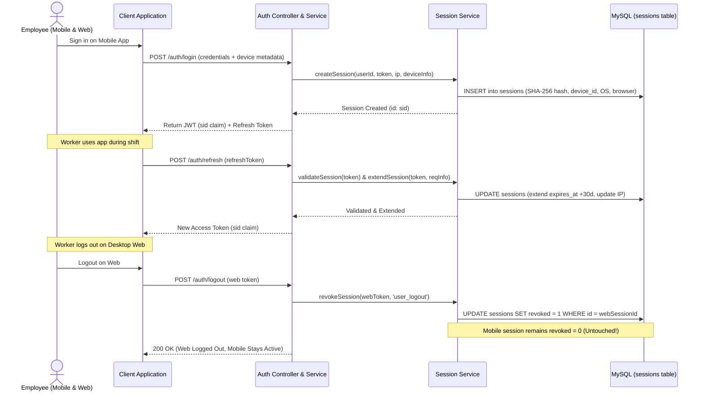

# Feature: Multi-Device Session Management and Device Security

> Place this file in /docs/features/. This describes the SYSTEM, not the work.
> This is an EXPLANATION doc (Diataxis) — business POV, plain language.
> Do not add author/assignee/status fields — task assignment lives in GitHub Issues.

## Business Goal
Provide workforce members with continuous, frictionless access across their personal and corporate devices (desktop web browsers, mobile apps, tablets) while giving users and SuperAdmins complete visibility and targeted control to revoke lost, stolen, or unauthorized device logins without disrupting active work on other devices.

## User Journey
Step-by-step what the user experiences, start to finish:
1. **Multi-Device Sign In**: An employee signs into the Mano platform on their office workstation browser and on the Mano mobile app on their smartphone. Both devices establish independent, secure, 30-day sliding sessions.
2. **Work Session Continuity**: The worker commutes between office Wi-Fi and mobile 4G/5G data networks. The mobile application transparently refreshes its authentication token without logging the worker out or dropping pending attendance punches.
3. **Self-Service Device Visibility**: The employee visits their Profile page and opens "Active Devices". They see a list of their logged-in hardware (e.g. "Google Chrome on Windows", "Mano Mobile App on Android"), complete with an IP address, last active timestamp, and a badge designating "This Device".
4. **Targeted Device Revocation**: If the employee leaves a personal laptop at a coffee shop or suspects an unauthorized login, they click "Revoke" on that specific device (or click "Sign out of all other devices"). The targeted workstation is immediately locked out upon its next request, while their smartphone remains signed in and operational.
5. **SuperAdmin Enterprise Oversight**: A SuperAdmin navigates to the Session Management Dashboard. They monitor enterprise-wide session KPIs (Total, Active, Revoked, Expired, Mobile vs Desktop), inspect real-time connection telemetry, and can terminate compromised sessions individually or in bulk.

## Business Rules
Rules a non-technical stakeholder (PM, client, support) needs to know:
- **Strict Device Isolation**: Ending a session on one device (such as logging out on a desktop browser) **never** terminates sessions on other devices (such as the employee's phone).
- **Graceful Network Roaming**: Shifting between IP addresses or cell towers does not trigger session invalidation or prompt for re-login; the system dynamically updates the last known IP.
- **Sliding Window Expiry**: Active sessions remain valid for 30 days from their last recorded usage. Every token refresh automatically extends the expiration date by another 30 days.
- **Password Reset Protection**: When a worker updates their password, all *other* devices are securely signed out to neutralize credential theft, while the device that performed the password update remains signed in to prevent workflow interruption.
- **Deduplicated Device Logins**: Logging in repeatedly on the exact same physical device replaces that device's prior session instead of multiplying ghost sessions.
- **Automatic Purging**: Expired and revoked sessions are retained for an administrative audit window (default 7 days) before being pruned by automated background maintenance.

## Systems Involved
Which modules/services participate, and in what order. Technical implementation details live in each module's own documentation:

Client Browser / Mobile App → [Authentication Middleware & Controller](file:///c:/Mano/Code/GIT/MANO-HRM-Web/backend/src/modules/auth/README.md) → [Session Service Boundary](file:///c:/Mano/Code/GIT/MANO-HRM-Web/backend/src/modules/auth/SESSION_MODULE.md) → [Device Parser Utility](file:///c:/Mano/Code/GIT/MANO-HRM-Web/backend/src/utils/deviceParser.js) → Database (MySQL sessions table) → [SuperAdmin Diagnostics Service](file:///c:/Mano/Code/GIT/MANO-HRM-Web/backend/src/modules/superadmin/README.md)

## Edge Cases (Business View)
Exceptional situations described in business terms, not stack traces:
- **Stale/Expired Cookie Sent by Web Browser**: If a browser sends an expired cookie alongside a valid mobile token, the system validates the fresh mobile token and rejects only the stale browser attempt without logging the user out platform-wide.
- **Lost Smartphone Revocation**: An employee revokes their mobile device from desktop web; the phone's next background sync or punch attempt receives an immediate `401 Unauthorized` and displays the login screen.
- **Dynamic IP Hopping**: An employee walks into an elevator where mobile reception switches from Wi-Fi to cellular LTE; the active session survives seamlessly and logs the updated IP.
- **Employee Termination**: When an administrator deactivates or deletes an employee account in User Management, database foreign key cascades immediately terminate all active sessions across all devices.

## Flow Diagram

