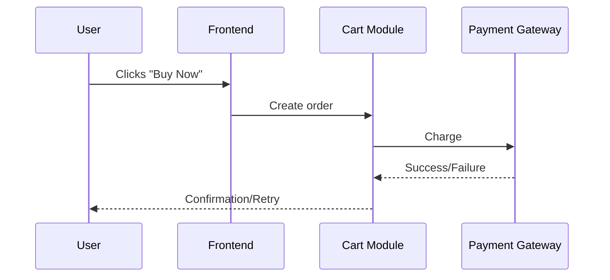

# Feature: [Feature Name]

> Place this file in /docs/features/. This describes the SYSTEM, not the work.
> This is an EXPLANATION doc (Diataxis) — business POV, plain language.
> Do not add author/assignee/status fields — task assignment lives in GitHub Issues.

## Business Goal
What problem does this solve for the business or the user? Plain language,
no implementation detail.

## User Journey
Step-by-step what the user experiences, start to finish.
1. ...
2. ...

## Business Rules
Rules a non-technical stakeholder (PM, client, support) needs to know:
- ...
- ...

## Systems Involved
Which modules/services participate, and in what order. Link each name to its
module README for technical detail.

Auth → Cart → Payment Gateway → Inventory → Notification

## Edge Cases (Business View)
Exceptional situations described in business terms, not stack traces:
- Payment fails mid-checkout → cart is preserved, user notified, no charge made

## Flow Diagram (C4 "Context" level)

## Glossary
Terms specific to this feature that need shared meaning across the team
(ubiquitous language — see also /docs/glossary.md for system-wide terms).
- **Term**: definition
