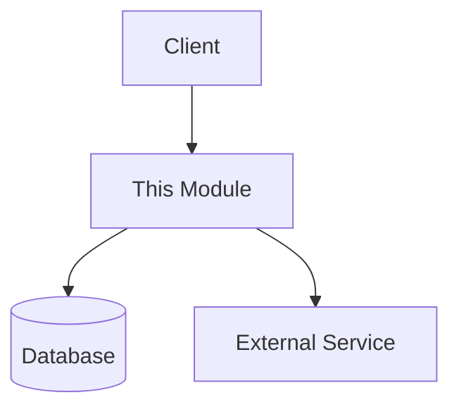

# Module: [Module Name]

> Place this file as README.md inside the module's own folder.
> This is a REFERENCE doc (Diataxis) — facts about the system, not a task log.
> Do not add author/date/status fields — git blame/log already gives you that.

## Purpose
One paragraph: what business capability does this module provide, and why does it exist?

## Responsibility (Bounded Context)
- This module owns: ...
- This module does NOT own: ... (name the module that does instead)

## Dependencies
- Depends on: [other internal modules / AWS services / third-party APIs]
- Depended on by: [modules or apps that call into this one]

## Data Model
Key entities/tables/collections and how they relate. Link to schema/ORM models
instead of duplicating them if that's easier to keep accurate.

## Interface / API
Endpoints, exported functions, or events this module exposes.
Link to the OpenAPI/Swagger spec if this module serves HTTP endpoints.

## Key Business Rules
Non-obvious logic that isn't self-evident from reading the code. Examples:
- "Refresh tokens expire in 30 days — contractual requirement from client X"
- "Orders can only be cancelled within 1 hour of placement"

## Edge Cases & Failure Modes
What happens on timeouts, invalid states, retries, partial failures.

## Known Limitations / Tech Debt
What a future developer should know before extending this module.

## Diagram (optional — C4 "Component" level)

